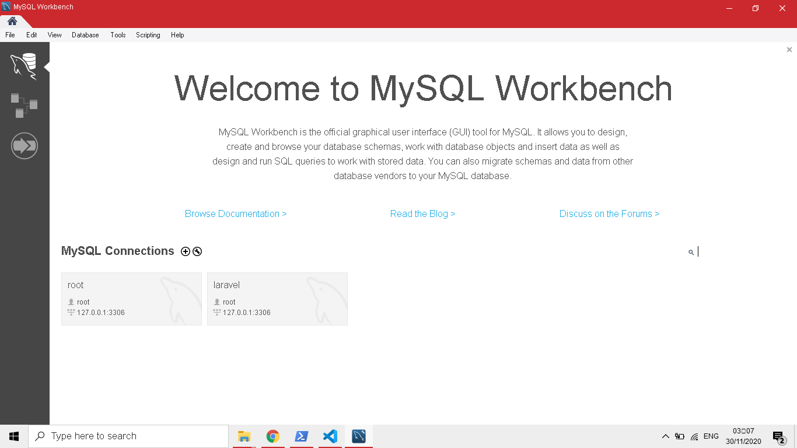

# Users List

 

## Installing on localhost.

* **Step 1.0**
Download the zip file from github

* **Step 2.0**
Extract the zipped file and open the terminal. In the terminal direct to the extracted folder 

* **Step 3**
In step 3 you a command in the terminal to update and install all the dependencies I used in the project
The command is *composer update*

* **Step 4**
in step 4 you create a local mysql database. Am using Mysql workbench, but phpMyAdmin is also fine

* **Step 5**
in step you create a Schema and name it (any name is fine)

* **Step 6**
In the extracted folder the .env was not included in the repo due to security reasons, they only include the .env.example so we have to rename it from .env.example to .env and save

* **Step 7**
in the .env file the app key is not included so we have to generate it

* **Step 8**
To generate the app key we have run a command on the terminal and the command is *php artisan key:generate*
The it will generated at the top

* **Step 9**
Under the The DB_CONNECTION of Mysql we have to confing the details 
under DB_DATABASE= *you write a name of the schema that you created on step 5*
Under DB_USERSNAME= *the username of your mysql or phpMyAdmin Database*
Under DB_PASSWORD= *the password of your mysql or phpMyAdmin Database*

* **Step 10**
In step 10 we have to migrate the tables to the created schema by running a command in the terminal the command is *php artisan migrate* if the config details are correct it will migrate properly 

* **Step 11**
In step 11 we should run the app at localhost and we do that by running a command and the command is *php artisan serve* after it finished it will show a localhost link. then whe copy the link to our browser 

* **Step 12**
then it should work. click on Users to create users

